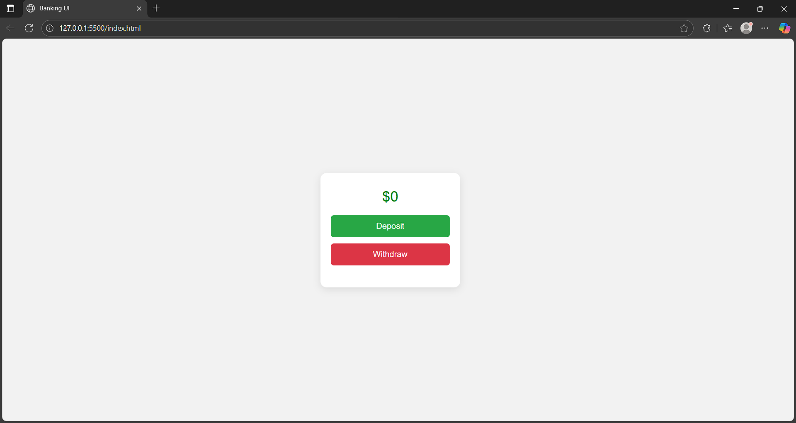

# 💰 Responsive Banking UI

A simple, clean, and responsive banking user interface built using only **HTML5** and **CSS3**. This UI displays a balance section along with two visually distinct buttons for **Deposit** and **Withdraw** actions.

## 🖼️ Preview

## 🎯 Features

- 💵 Centered balance display  
- ✅ Green "Deposit" button  
- ❌ Red "Withdraw" button  
- 📱 Fully responsive layout (mobile, tablet, desktop)  
- ✨ Modern card design with shadows and rounded corners  
- 🎨 No JavaScript — pure HTML & CSS

## 🛠️ Technologies Used

- HTML5  
- CSS3 (Flexbox for layout)

## 🚀 Getting Started
